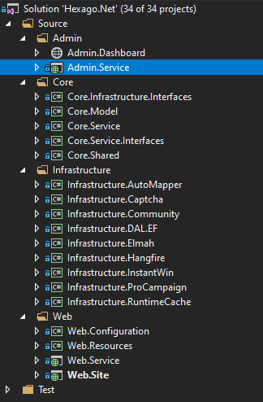
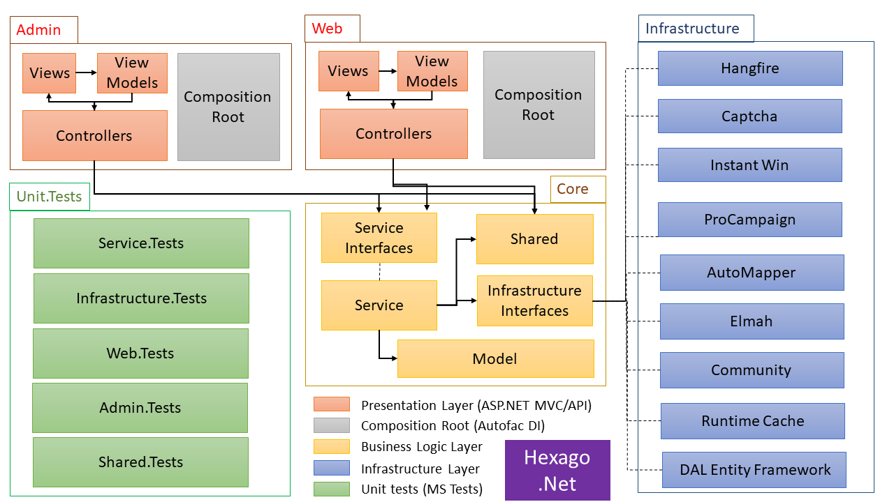

# Hexago .net
A .Net framework monolith web project template using hexagonal architecture

## 1. Author

Nalijaona Irina Andriamifidy  
@sourcewalker

## 2. Structure

This Template is as ASP.NET Framework web project using .NET Framework 4.7.2 structured as following:  

  
*Fig. 1: Hexago .Net VS Project Structure*

## 3. Achitecture

The architectural overview of the template is resumed as per the following image:

  
*Fig. 2: Hexago .Net Project Architecture*
